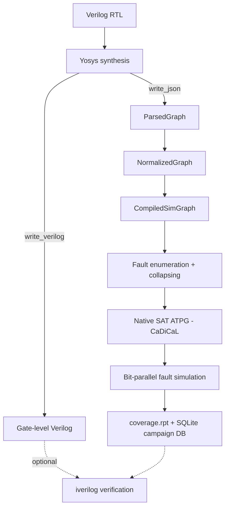

# About faultflow

faultflow is a standalone, gate-level **fault simulator** and **automatic test
pattern generator (ATPG)**. It takes a netlist that has already been synthesized to
standard cells, enumerates manufacturing-defect faults on it, and answers two
questions:

1. **How many of those faults can a given set of test vectors detect?** (fault
   simulation / coverage grading)
2. **What test vectors detect the remaining faults?** (ATPG)

It is aimed at post-synthesis netlists from [Yosys](https://yosyshq.net/yosys/),
mapped to a supported standard-cell library (Sky130 HD or OSU035).

## Design in one picture

The Python layer orchestrates the flow (synthesis, ATPG loop, reporting); the C++
core does the heavy lifting (IR compilation, simulation, SAT solving). See the
[Architecture overview](architecture/overview.md) for the details.

## Feature matrix

The following capabilities are **implemented and working today**:

| Area | Capability |
|---|---|
| Fault models | Stuck-at (SA0/SA1); transition (slow-to-rise / slow-to-fall) — combinational broadside plus scan launch-on-capture (LOC) and launch-on-shift (LOS) |
| Simulation | 64-lane bit-parallel engine; scalar golden-reference cross-check; binary (two-valued) signals |
| ATPG | Native SAT (CaDiCaL); progressive loop; simulator-verified vectors; redundancy (UNSAT) classification |
| Fault handling | Checkpoint enumeration; equivalence-only collapsing (never dominance, so coverage is provably unchanged); reverse-order and dynamic test-set compaction |
| Sequential | Posedge and negedge D flip-flops; asynchronous set/reset (clear/preset with polarity) |
| Scan | Generic scan-chain insertion and stitching; scan checking; scan SAT ATPG; Sky130 scan-cell techmap |
| Test modes | IEEE 1500 wrapper (functional / intest / extest); native shiftable wrapper boundary register (WBR) |
| Hierarchy | Per-block INTEST plus assembly EXTEST aggregated into one chip coverage number; scan-pattern retargeting onto an SoC scan path |
| Multi-clock | Domain-aware test protocol; per-domain at-speed; cross-domain paths masked |
| Design rules | `rule_check` — a DFT structural rule check whose rule set continues to grow |
| PDKs | Sky130 HD (default) and OSU035, via JSON cell maps |
| Verification | Optional iverilog gate that re-simulates the gate-level netlist against golden outputs |
| Interfaces | Interactive Tcl shell (the primary interface); the `ff.py` / `faultflow` batch CLI; an OpenTestability "oracle" mode |

The following are **planned** and described in the [Roadmap](roadmap.md):
three-valued (X-state) simulation, a general latch model, and tristate/TBUF handling
(currently a hard error by policy).

## License

faultflow is released under the Apache-2.0 license.
