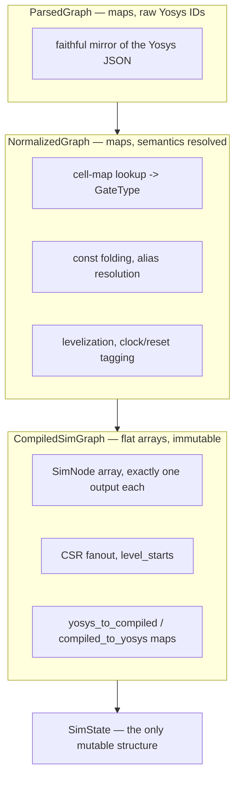
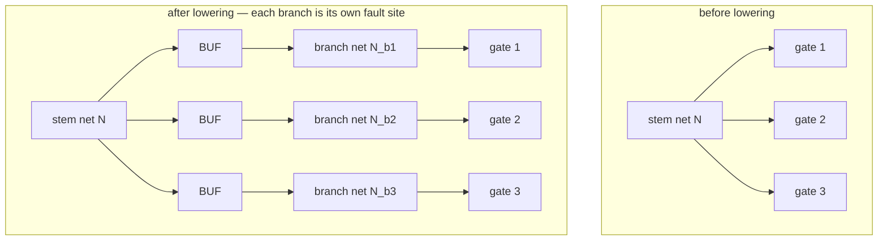
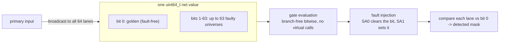
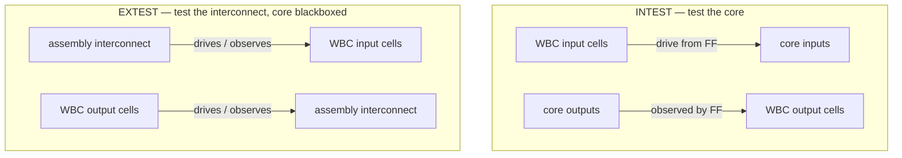
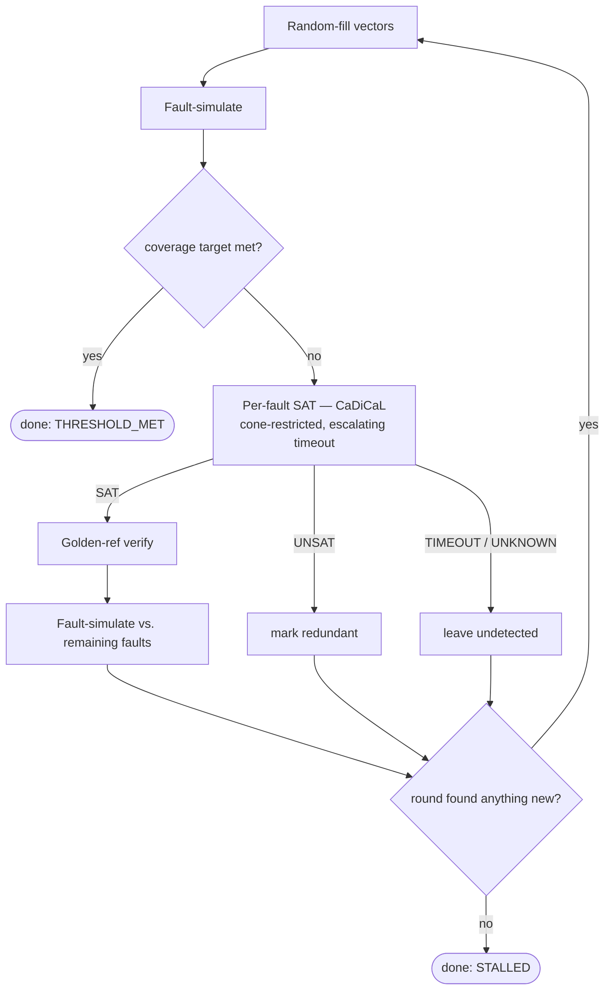

# Architecture overview

faultflow is a Python control plane over a C++17 simulation core. The Python layer
orchestrates synthesis, the ATPG loop, and reporting; the C++ core compiles the
netlist into an execution-ready form and does all simulation and SAT solving. The two
are joined by a [pybind11](https://pybind11.readthedocs.io/) module named
`_faultflow_core`.

## The three-layer IR

The single most important design decision is that the netlist passes through **three
distinct intermediate representations**, each with a clear job:

- **ParsedGraph** (`src/core/ir/parsed_graph/`) is a faithful, map-based mirror of the
  Yosys JSON. It preserves raw integer net IDs, separates blackbox modules, and finds
  the top module. No cell semantics live here.
- **NormalizedGraph** (`src/core/ir/normalized_graph/`) resolves meaning: it looks up
  each cell in the JSON cell map, applies the unsupported-cell policy, folds constants
  into `CONST0`/`CONST1` driver nodes, creates a source pseudo-node for every net (so
  every net has exactly one driver), resolves net aliases, levelizes the graph, and
  identifies clock and reset nets.
- **CompiledSimGraph** (`src/core/ir/compiled_graph/`) is flat and immutable: arrays of
  `SimNode`s (each with a fixed set of input indices and exactly one output), CSR
  fanout, level boundaries, the observable set, and bidirectional maps between the
  sparse Yosys net IDs and the dense compiled indices. This is the only form the
  simulation hot loop ever touches.

The pipeline is assembled and cached in
`src/core/ir/compiled_graph/graph_cache.cpp`, keyed on the netlist and cell-map files
so edits force a rebuild.

### Lowering rules

The `GraphCompiler` enforces two invariants that the simulator relies on:

- **One output per node.** Multi-output cells are split: a full adder becomes separate
  sum and carry nodes (`ADDF_S`, `ADDF_CO`); a flip-flop with a `QN` pin becomes the
  flip-flop node plus an inverter.
- **Every fanout branch is its own net.** A `BUF` node is inserted per branch so that a
  fault on a branch is an ordinary net fault. This realizes the checkpoint fault model
  (see below) structurally:

## The simulation engine

The engine (`src/core/sim/engine/`) is **64-lane bit-parallel**: each net's value is a
`uint64_t` where **bit 0 is the fault-free (golden) value and bits 1–63 are 63
independent faulty universes**. A primary-input value is broadcast to all 64 lanes;
faults are injected into the faulty lanes after a node evaluates (SA0 clears the bit,
SA1 sets it); detection compares each observable lane against the golden bit.

Gate evaluation (`src/core/sim/gate_eval.cpp`) is a branch-free bitwise table with no
virtual calls — one `uint64_t` operation evaluates 64 universes at once. The engine is
strictly **binary**; there is no X/Z value (a deliberate design decision, with
three-valued simulation on the [roadmap](../roadmap.md)).

Every result is cross-checked against a scalar **golden-reference simulator**
(`src/core/sim/golden_ref/`) that simulates one fault at a time with plain maps. If the
bit-parallel engine and the golden reference ever disagree, the bit-parallel engine has
a bug — see [Testing & verification](../testing.md) for how this is enforced as a hard
regression gate. The same golden reference also re-verifies every SAT-generated vector
before it is trusted.

The only mutable state during simulation is `SimState` (`src/core/sim/state/`), which
owns the working net values, flip-flop state, and previous-cycle values for edge
detection. One immutable `CompiledSimGraph` can back many `SimState`s.

## Sequential and scan

Sequential simulation is implemented: the engine detects clock edges from the
previous-vs-current clock value, applies clear/preset with polarity and conflict
resolution, and steps flip-flop state across the cycles of a test vector. Flip-flop
configuration (trigger edge, clock/data/output nets, set/reset, scan pins) comes from
the JSON cell map, not from decoding primitive name strings.

Scan support (`src/core/scan/`) extracts and validates chains, then simulates the
load/launch/capture/unload protocol with the flip-flops modeled as pseudo-primary
inputs and outputs — which reduces scan ATPG to the combinational SAT problem.

## IEEE 1500 wrapper and hierarchy

The Tcl shell's `wrap` command injects wrapper boundary register (WBR) cells onto a
synthesized netlist's boundary ports; they are ordinary lowered cells to the
simulator, not a special-cased path. `set_testmode` then selects which side of the
wrapper is the device under test:

For a chip built from several wrapped blocks, `faultflow/project/` (`orchestrator.py`,
`aggregate.py`, `assemble.py`) drives per-block INTEST plus one assembly EXTEST and
aggregates the results into a single chip-level coverage number — the `project` CLI
command and `flowscripts/hereichy_atpg.tcl` are the two ways to run it. Block-level
scan patterns can also be retargeted onto an SoC-level scan path (`faultflow/retarget/`)
without re-running ATPG. See [Flow recipes](../user_guide/examples.md) for worked
examples of both.

## The fault model

- **Enumeration** (`src/core/fault/enumerator/`) walks every compiled net — which
  already includes primary-input source nets and materialized fanout branches — and
  emits SA0 and SA1. Exclusions (clock, reset, blackbox) are tagged on the fault, not
  skipped.
- **Collapsing** (`src/core/fault/collapser/`) shrinks the list by verified
  **equivalence** only (never dominance) — INV/BUF, the controlling-value input of
  AND/OR/NAND/NOR, and the compound AOI/OAI cells; see
  [Collapsing rules](../collapsing_rules.md).
- Faults are carried at runtime as flat `CompactFault` records, batched 63 at a time to
  match the 63 faulty lanes.
- The observable set is primary outputs plus any net tagged as a test point (`is_tp`).
  Test points come from an optional `tp_nodes.json` file — a JSON array of
  `{"net": "<name>"}` and/or `{"net_id": <id>}` entries — or from the `add_tp`
  OpenTestability flow (see [Test-point insertion](../user_guide/testpoints.md)). A
  missing `tp_nodes.json` is silently ignored.

## Native SAT ATPG

The ATPG (`src/core/atpg/`) is native and built on
[CaDiCaL](https://github.com/arminbiere/cadical):

1. `cnf_encoder.cpp` builds a CNF for the circuit, one clause group per gate (derived
   from the same gate-evaluation semantics the simulator uses).
2. `fault_solver.cpp` builds fault-free and faulty CNF copies, ties the primary inputs
   together except at the fault net, forces the stuck-at value, and adds a miter
   constraint that some observable output must differ.
3. The solver returns **SAT** (a test vector, which is then re-simulated to confirm),
   **UNSAT** (the fault is redundant under the current model), or **TIMEOUT/UNKNOWN**
   (left undetected — never marked redundant).

The progressive loop lives partly in C++ (`progressive_atpg.cpp`) and partly in the
Python harness (`faultflow/runner/progressive_atpg.py`), which decides when the
campaign has stalled. Redundant classifications are tagged with a
`redundancy_model_id` so they can be invalidated if the design fingerprint or model
changes.

## End-to-end flow

1. `python3 ff.py sim` (or the equivalent shell commands) → `faultflow/cli.py` /
   `faultflow/shell/` → `faultflow/service/flow.py` → `faultflow/runner/runner.py`.
2. If the input is Verilog, Yosys is run with the locked synthesis template, producing
   `<top>.json` and `<top>_gate.v`.
3. The Python layer imports `_faultflow_core` and calls into it; the C++ core builds
   the three-layer IR, enumerates and collapses faults, runs SAT ATPG, verifies and
   fault-simulates the vectors, and writes the SQLite campaign database.
4. `faultflow/reporter/coverage.py` queries the database and emits `coverage.rpt` and
   `coverage_report.json`.
5. Optionally, `faultflow/verify/gate.py` compiles the gate-level netlist plus the PDK
   behavioral models with iverilog and checks the vectors against golden outputs — see
   [Testing & verification](../testing.md).

## Files worth reading first

| File | Why |
|---|---|
| `src/core/ir/compiled_graph/graph_cache.cpp` | The IR pipeline entry point |
| `src/core/ir/compiled_graph/compiled_graph.hpp` | The flat execution model |
| `src/core/sim/engine/bit_parallel_sim.cpp` | The 64-lane simulation core |
| `src/core/sim/gate_eval.cpp` | Authoritative gate semantics |
| `src/core/common/types.hpp` | Every enum and struct |
| `src/core/atpg/fault_solver.cpp` | Native SAT ATPG |
| `src/core/bindings/python_bindings.cpp` | The exact Python ↔ C++ surface |
| `faultflow/runner/runner.py` | Yosys invocation and orchestration |
| `faultflow/wrap/ports.py` | IEEE 1500 WBR injection |
| `faultflow/project/orchestrator.py` | Hierarchical block-to-SoC aggregation |
