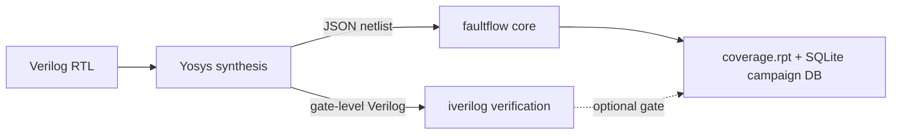

# faultflow

**faultflow** is a gate-level fault simulator and native SAT ATPG engine for
post-synthesis netlists produced by [Yosys](https://yosyshq.net/yosys/). It grades
stuck-at and transition faults, generates test patterns with a built-in SAT-based
ATPG, and reports fault coverage against a precisely defined denominator.

It is built as a Python control plane over a C++17 simulation core, with the two
joined by a [pybind11](https://pybind11.readthedocs.io/) bridge. Everyday use is
through an interactive **Tcl shell**; a batch CLI covers the same ground for
scripted, one-shot runs.

```{note}
faultflow targets **Unix-like systems only** (Linux, or Windows via WSL). There is
no native Windows build. See [Installation](getting_started/installation.md).
```

## What it does

- **Stuck-at and transition fault grading** on flat, post-synthesis gate-level
  netlists, using a 64-lane bit-parallel simulation engine cross-checked against a
  scalar golden reference.
- **Native SAT ATPG** (CaDiCaL) that produces simulator-verified test vectors, with
  a progressive loop, fault collapsing, and reverse-order test-set compaction.
- **Sequential and scan support**: edge-triggered flip-flops, asynchronous
  set/reset, scan-chain insertion, and scan ATPG.
- **IEEE 1500 wrapper test and hierarchy**: INTEST/EXTEST boundary test, a native
  shiftable WBR, and hierarchical block-to-SoC coverage aggregation.
- **Two PDKs**: SkyWater Sky130 HD (default) and OSU035, driven by JSON cell maps.
- **Deterministic coverage reporting** with an explicit, auditable denominator.



## Getting started

::::{grid} 1 2 2 2
:gutter: 3

:::{grid-item-card} Installation
:link: getting_started/installation
:link-type: doc
Build the C++ core and set up the Python environment on Linux or WSL.
:::

:::{grid-item-card} Quick start
:link: getting_started/quickstart
:link-type: doc
Run your first fault-simulation campaign on the `c17` benchmark from the
interactive Tcl shell.
:::

:::{grid-item-card} Concepts
:link: getting_started/concepts
:link-type: doc
Stuck-at faults, ATPG, the coverage denominator, and scan in plain terms.
:::

:::{grid-item-card} Running without the shell
:link: user_guide/running_without_shell
:link-type: doc
The batch `ff.py` / `faultflow` CLI, for scripted and one-shot runs.
:::

::::

## Learn more

- [About faultflow](about.md) — the feature matrix and a high-level tour.
- [Architecture overview](architecture/overview.md) — the three-layer IR and the
  simulation engine.
- [Testing & verification](testing.md) — how correctness is established and kept
  that way (the golden-reference cross-check).
- [Benchmarks](benchmarking.md) — ISCAS-85/89, transition faults, and PicoRV32a
  results.
- [Roadmap](roadmap.md) — what is planned next.

```{toctree}
:hidden:
:caption: Introduction

about
getting_started/concepts
```

```{toctree}
:hidden:
:caption: Getting Started

getting_started/installation
getting_started/quickstart
```

```{toctree}
:hidden:
:caption: User Guide

user_guide/tcl_shell
user_guide/examples
user_guide/configuration
user_guide/running_without_shell
user_guide/testpoints
user_guide/outputs
```

```{toctree}
:hidden:
:caption: Architecture

architecture/overview
architecture/cell_libraries
collapsing_rules
```

```{toctree}
:hidden:
:caption: Reference

testing
benchmarking
external_tools
```

```{toctree}
:hidden:
:caption: Project

contributing
roadmap
```
