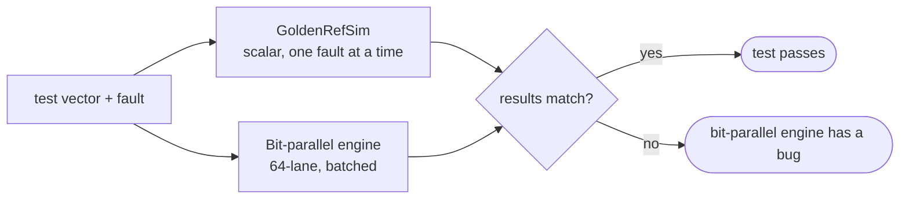
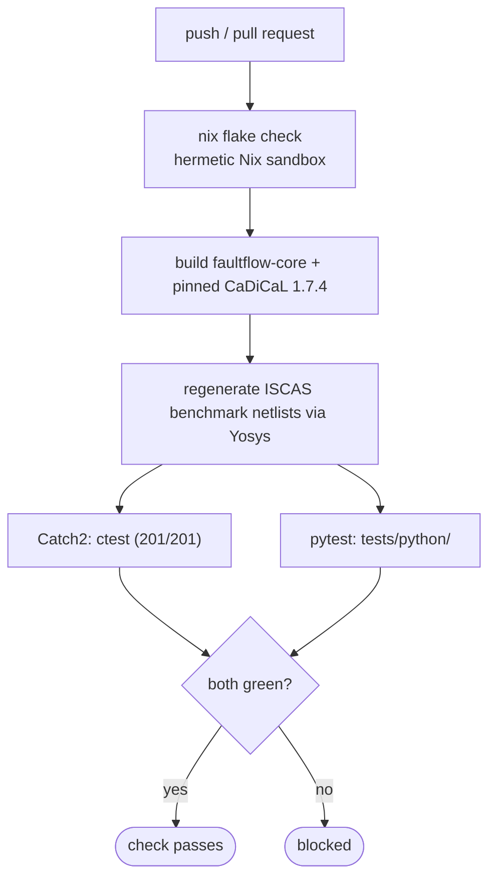

# Testing & verification

faultflow has two test suites — **Catch2** for the C++ core and **pytest** for the
Python layer — organized by subsystem, plus an optional iverilog gate that checks
generated vectors against independently-simulated golden outputs. The
methodology is test-first: behavior is specified by a failing test before it's
implemented, and every simulation result is cross-checked against a scalar
reference simulator.

## The golden-reference cross-check

The **golden reference** (`GoldenRefSim`, `src/core/sim/golden_ref/`) is a scalar
simulator: one fault at a time, plain maps, no batching, no bit-tricks — built to
be obviously correct rather than fast. It is the ground truth the 64-lane
bit-parallel engine is measured against.



If the two ever disagree, **the bit-parallel engine is considered wrong** — never
the golden reference. This is a hard rule, not a guideline: a mismatch is a bug to
fix, not a golden file to update. The same golden reference also **re-verifies
every SAT-ATPG-generated vector** before it is trusted and written to the campaign
database.

## Test organization

### C++ (Catch2) — `tests/cpp/`

| Directory | Covers |
|---|---|
| `ir/` | ParsedGraph, NormalizedGraph, CompiledSimGraph, WBR cell lowering |
| `fault/` | Enumeration, collapsing, batch manager, fault-effect polymorphism |
| `sim/` | Gate evaluation (30+ gate types), golden reference, bit-parallel engine, fault injection, sequential FF, WBR modes |
| `atpg/` | Miter construction, CNF truth tables, compaction, cone ordering/equivalence, incremental-SAT, SAT timeout, transition + scan-transition + scan-LOS |
| `scan/` | Scan chain extraction, multi-clock stagger, scan sequences |
| `db/` | SQLite campaign store — schema, fingerprinting, resume validation |
| `benchmarks/` | Performance benchmarks (`c17`), compiled into the same Catch2 binary — there is no separate micro-benchmark executable |

Style: every test follows GIVEN / WHEN / THEN, runs in under a second, and uses
small hand-authored Yosys-JSON fixtures rather than external tools.

### Python (pytest) — `tests/python/`

| Directory | Covers |
|---|---|
| `cli/` | Shell and CLI command parsing, subcommand flow, config loading |
| `sim/` | Vector application, fault batching, observable-set tracking, cycle-based sequential simulation |
| `atpg/` | Progressive ATPG, transition-fault queries, compaction, timeout/unknown handling, redundancy persistence |
| `scan/` | Scan-chain insertion and protocol, INTEST/EXTEST fusion, scan ATPG |
| `wrap/` | IEEE 1500 wrapper boundary cells — modes, tri-state control, port observation |
| `project/` | Hierarchical block-to-SoC aggregation, owning-role rules, SoC retargeting |
| *(root level)* | `config.ofs` parsing, flow-service orchestration, oracle mode, cell inventory |

`tests/unit/` is reserved for future use and currently empty.

### Markers

Registered in `tests/python/conftest.py`:

| Marker | Meaning |
|---|---|
| `unit` | Fast, no external tools |
| `golden` | Requires the `GoldenRefSim` C++ extension, no external tools |
| `integration` | Requires external tools (Yosys, iverilog, Quaigh, ...) |
| `slow` | Benchmark circuits or long-running operations (>30s) |
| `verification` | Vector-verification-gate tests (iverilog) |
| `sequential` | Sequential-circuit feature tests |

## Coverage targets

The project's internal TDD contract records per-module coverage targets — these
are documented goals to keep critical paths well-tested, not (today) an
automated CI gate: there is no committed coverage-threshold config, and the CI
job below runs the test suites without failing the build on a numeric coverage
shortfall.

| Scope | Target |
|---|---|
| Global | 85% |
| `sim/golden_ref` | 99% |
| `fault/enumerator` | 95% |
| `ir/parsed_graph`, `ir/compiled_graph` | 90% |
| `sim/engine` | 90% |
| `ir/normalized_graph`, `fault/collapser`, `db` | 85% |
| `reporter` | 80% |
| `cli` | 75% |

## How to run the tests

All commands run in **WSL** (see the [WSL-only note](getting_started/installation.md)
— there is no native Windows build). Build the C++ extension first; every test
suite needs it:

```bash
cmake -S . -B build -G Ninja
cmake --build build -- -j4
```

Python:

```bash
pytest tests/python/ -v                          # everything
pytest tests/python/ -m 'not slow' -v             # skip slow benchmarks
pytest tests/python/scan/ -v                      # one subsystem
pytest tests/python/ -k 'collapsing' -v           # by name pattern
pytest tests/python/ --cov=faultflow --cov-report=html
```

C++:

```bash
ctest --test-dir build --output-on-failure -j4
ctest --test-dir build -R 'SimEngine' --output-on-failure   # one suite
```

Lint and type-check (required before a PR):

```bash
black . && flake8 . && mypy .
```

## The iverilog verification gate

Separate from the golden-reference cross-check, `faultflow/verify/gate.py` is an
**independent, external** correctness check: it compiles the Yosys
`write_verilog` gate-level netlist together with the PDK's behavioral Verilog
models and a generated testbench, then simulates the faultflow-generated vectors
through Icarus Verilog and compares the results against faultflow's own golden
outputs. It is off by default (`[simulation] verify = false`) since it needs
`iverilog` on `PATH`; enable it with `-v true` (CLI) or `[simulation] verify =
true` (config) when you want that extra, tool-independent confirmation. See
[External tools](external_tools.md).

## Continuous integration

CI is a single GitHub Actions job (`.github/workflows/nix.yml`, `flake-check`)
that runs `nix flake check` on every push and pull request:



Both suites run **fully hermetically** inside the Nix sandbox — no manual
checkout step, no local `nix develop` shell required, and no external network
access. The ISCAS benchmark netlists the checks need are regenerated from the
tracked RTL sources via a Yosys `preCheck`/`checkPhase` step rather than being
committed. First runs are slow (roughly 15–30 minutes, since `faultflow-core`
and the pinned CaDiCaL 1.7.4 compile from source); a binary cache (e.g. Cachix)
speeds up repeat runs — see
[Building with Nix](getting_started/installation.md#building-with-nix).

The documentation site has its own, separate CI path
(`.github/workflows/docs.yml`) that builds and deploys `docs/` — see
[Contributing](contributing.md).
