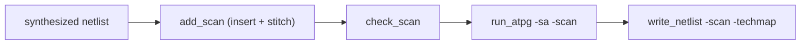

# Flow recipes

The repository ships several ready-to-run designs under `examples/` plus the
ISCAS-85/89 benchmark circuits under `tests/benchmarks/`. This page walks through
the shell-based flow for each major capability; the `flowscripts/*.tcl` recipes
introduced in [The Tcl shell](tcl_shell.md) automate the same sequences.

```{note}
The combinational `c17` smoke test is covered in the
[Quick start](../getting_started/quickstart.md). The examples below add live
synthesis, scan, wrapper test modes, and a large real-world core.
```

## Flat ATPG, synthesized from Verilog: `cla4`

`examples/cla4.v` is a 4-bit carry-lookahead adder (9 inputs, 5 outputs, purely
combinational).

```tcl
faultflow> read_netlist examples/cla4.v -top cla4
faultflow[cla4]> use_lib_cells sky130
faultflow[cla4:sky130]> synth
faultflow[cla4:sky130]> run_atpg -sa -target 95
faultflow[cla4:sky130]> status
faultflow[cla4:sky130]> report
```

This needs `yosys` on your `PATH` — `synth` runs real synthesis on the Verilog.
`flowscripts/flat_atpg.tcl` automates the same sequence, but expects a clock port
(it always calls `add_clock`); since `cla4` has no clock at all, the manual
sequence above is simpler for purely combinational designs.

## Scan insertion and scan ATPG: `serial_adder`

`examples/serial_adder.v` is a bit-serial adder with flip-flops — a minimal
sequential/scan example.



```tcl
faultflow> read_netlist examples/serial_adder.v -top serial_adder
faultflow[serial_adder]> use_lib_cells sky130
faultflow[serial_adder:sky130]> add_clock clk
faultflow[serial_adder:sky130]> synth
faultflow[serial_adder:sky130]> add_scan -chains 4 -SI scan_in -SO scan_out -SE scan_en
faultflow[serial_adder:sky130]> check_scan
faultflow[serial_adder:sky130]> run_atpg -sa -scan -target 95
faultflow[serial_adder:sky130]> status -scan
faultflow[serial_adder:sky130]> report
faultflow[serial_adder:sky130]> write_netlist -scan -techmap
```

This exact sequence — plus a dry-run preview and session checkpointing — is
automated by `flowscripts/scan.tcl` (edit its `CONFIGURATION` block, then run
`python3 ff.py shell -f flowscripts/scan.tcl`).

The batch-CLI equivalent:

```bash
python3 ff.py init       --top serial_adder -c examples/serial_adder_sky130.ofs
python3 ff.py scan       --top serial_adder -c examples/serial_adder_sky130.ofs
python3 ff.py scan-check --top serial_adder -c examples/serial_adder_sky130.ofs
python3 ff.py sim --scan --top serial_adder -c examples/serial_adder_sky130.ofs
python3 ff.py status --scan --top serial_adder -c examples/serial_adder_sky130.ofs
```

The combinational and scan campaigns share one database, so `status`
(combinational) and `status --scan` report from the same
`output/serial_adder/.faultflow/faultflow.sqlite`.

## IEEE 1500 wrapper test: INTEST and EXTEST

Wrapping a core with an IEEE 1500 boundary is a two-phase flow: inject the
wrapper once with `wrap`, then scan-insert and run ATPG against the *wrapped*
netlist. `wrap` saves the wrapped netlist and makes it the new active design in
the same session, so you can continue straight on:

```tcl
faultflow> read_netlist examples/serial_adder.v -top serial_adder
faultflow[serial_adder]> use_lib_cells sky130
faultflow[serial_adder:sky130]> synth
faultflow[serial_adder:sky130]> wrap -model scan -clock clk -o output/serial_adder/serial_adder_wrapped.json
faultflow[serial_adder:sky130]> set_testmode intest
faultflow[serial_adder:sky130]> add_scan -chains 4
faultflow[serial_adder:sky130]> check_scan
faultflow[serial_adder:sky130]> run_atpg -sa -scan -target 95
faultflow[serial_adder:sky130]> status -scan
```

`flowscripts/core_atpg.tcl` automates the scan-insertion-plus-INTEST half against
an already-wrapped netlist; `flowscripts/intest.tcl` resumes a saved scan session
and runs INTEST alone. The CLI equivalent, once `[design] netlist` in
`config.ofs` points at the wrapped, scan-inserted netlist, is
`python3 ff.py intest --top serial_adder -c config.ofs`.

**EXTEST** targets the interconnect *around* wrapped cores in a multi-block
assembly, with each core's internals blackboxed so only the wrapper boundary
cells and the interconnect are faultable:

```tcl
faultflow> read_netlist assembly.json -top my_soc_top
faultflow[my_soc_top]> use_lib_cells sky130
faultflow[my_soc_top:sky130]> add_clock clk
faultflow[my_soc_top:sky130]> add_blackbox u_coreA
faultflow[my_soc_top:sky130]> add_blackbox u_coreB
faultflow[my_soc_top:sky130]> synth
faultflow[my_soc_top:sky130]> set_testmode extest
faultflow[my_soc_top:sky130]> run_atpg -sa -target 90
faultflow[my_soc_top:sky130]> status
```

`flowscripts/extest.tcl` automates this — edit its `CONFIGURATION` block with
your block instance names, assembly netlist path, and clock port. The CLI
equivalent is `python3 ff.py extest --top my_soc_top -c config.ofs`.

## Hierarchical SoC: per-block INTEST + assembly EXTEST

For a chip with multiple wrapped blocks, `flowscripts/hereichy_atpg.tcl` drives
the full flow: scan-insert and INTEST each block in turn, then run one assembly
EXTEST, following a project manifest (`project_*.json`, schema
`faultflow_project_v1`) that names each block and the assembly. The CLI
equivalent is a single command once that manifest exists:

```bash
python3 ff.py project -p project.json -t 95
```

`project` aggregates the per-block INTEST results and the assembly EXTEST result
into one chip-level coverage number.

## More designs under `examples/`

Beyond `cla4` and `serial_adder`, the repository ships additional RTL to grade
with your own config (see [Bringing your own design](#bringing-your-own-design)
for the config pattern — none of these ship with a `.ofs`):

- **DSP filters** — `dsp_iiravg.v` (IIR averager, top `iiravg`), `dsp_boxcar.v`
  (boxcar / moving-average, top `boxcar`), and `dsp_genericfir_small.v` /
  `dsp_genericfir_full.v` (parameterized FIR filters). Real sequential
  arithmetic; good mid-size stuck-at and transition-fault targets.
- **RV32I cores** — `rv32i_single_cycle.sv` and `rv32i_multi_cycle.sv`,
  synthesizable SystemVerilog RISC-V cores (MIT-licensed; see
  `examples/RV32I_UPSTREAM_LICENSE`). Larger multi-module designs that exercise
  the SystemVerilog synthesis path (`read_verilog -sv`).

A pre-synthesized PicoRV32 Sky130 netlist lives under `examples/picorv32_synth/`
and backs the benchmarking numbers (see [Benchmarks](../benchmarking.md)); it
is a generated build artifact and is not tracked in git.

## Bringing your own design

From the shell there's no config file to write at all — just point the commands
at your own files:

```tcl
faultflow> read_netlist path/to/my_design.v -top my_design
faultflow[my_design]> use_lib_cells sky130
faultflow[my_design:sky130]> synth
faultflow[my_design:sky130]> run_atpg -sa -target 95
faultflow[my_design:sky130]> status
```

faultflow runs the locked Yosys synthesis script automatically when the input is
Verilog (so `yosys` must be on your `PATH`); if your netlist is already
synthesized to standard cells, give the Yosys JSON directly and `synth` just
validates it.

For a **repeatable** run — the same design driven by the batch CLI, or preloaded
into the shell — write a minimal `config.ofs`:

```ini
[design]
netlist  = path/to/my_design.v
top      = my_design
cell_lib = cells/sky130/sky130_fd_sc_hd.json
liberty  = cells/sky130/sky130_fd_sc_hd__tt_025C_1v80.lib

[atpg]
tool     = native
```

See [Running without the shell](running_without_shell.md) for the equivalent
batch commands.

## A reusable batch script

The ISCAS-85 circuits (`c17`, `c432`, `c499`) ship as Verilog under
`tests/benchmarks/iscas85/`. This kind of repeated, scripted sweep over many
designs is exactly what the batch CLI is for — see
[Running without the shell](running_without_shell.md). This script synthesizes
and grades all three with the native ATPG by generating a small config per
circuit. Save it as `run_iscas85.sh` at the repo root:

```bash
#!/usr/bin/env bash
# run_iscas85.sh — grade the ISCAS-85 circuits with the native SAT ATPG.
set -euo pipefail

for top in c17 c432 c499; do
  cfg="$(mktemp --suffix=.ofs)"
  cat > "$cfg" <<EOF
[design]
netlist  = tests/benchmarks/iscas85/${top}.v
top      = ${top}
cell_lib = cells/sky130/sky130_fd_sc_hd.json
liberty  = cells/sky130/sky130_fd_sc_hd__tt_025C_1v80.lib

[atpg]
tool     = native

[report]
threshold = 100.0
EOF

  echo "=== ${top} ==="
  python3 ff.py init   --top "$top" -c "$cfg"
  python3 ff.py sim    --top "$top" -c "$cfg"
  python3 ff.py status --top "$top" -c "$cfg"
  rm -f "$cfg"
done
```

Run it from a WSL/Linux shell with the venv active:

```bash
chmod +x run_iscas85.sh
./run_iscas85.sh
```

Each circuit's deliverables land in `output/<top>/` (see
[Outputs & reports](outputs.md)). The sequential ISCAS-89 circuits ship as
Verilog under `tests/benchmarks/iscas89/` (for example `s27.v`, `s298.v`), each
declaring a module named `s<N>_bench`; point `[design] netlist` at the `.v` and
set `top` to that module name (e.g. `s27_bench`), then follow the scan flow shown
for `serial_adder`.
