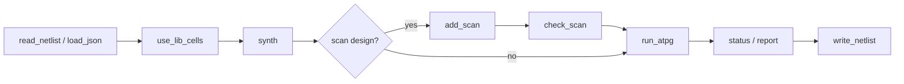

# The Tcl shell

faultflow's primary interface is an interactive, **Tcl-based command shell** that
holds a live project session. Load a netlist, synthesize, insert scan, run ATPG,
insert test points, and publish netlists step by step — or drive the whole flow
from a script. A batch CLI covering the same core operations also exists, for
scripted, one-shot runs where a live session isn't needed; see
[Running without the shell](running_without_shell.md).

## Starting the shell

```bash
python3 ff.py shell                 # interactive REPL
python3 ff.py shell -c config.ofs   # preload a project config
python3 ff.py shell -f flow.tcl     # run a script, then exit
```

| Flag | Default | Meaning |
|---|---|---|
| `-f`, `--file PATH` | — | Execute a Tcl script non-interactively, then exit |
| `-c`, `--config PATH` | — | Preload a project config (requires `[design] top`); auto-runs `read_netlist` and `use_lib_cells` |
| `--out PATH` | `output` | Output root directory |
| `--verbose` | off | DEBUG logging with timestamps; expands result rendering to show Details/Artifacts/Metrics/Warnings |

## The REPL

- The prompt starts bare (`faultflow> `) and grows to show the loaded design and
  PDK profile as session state accumulates: `faultflow[c17]> ` once a design is
  loaded, `faultflow[c17:sky130]> ` once a PDK is also selected.
- Multi-line input is supported (continuation lines show `... `); exit with `quit`,
  `exit`, or EOF (Ctrl-D).
- Tab-completes command names; arrow-key history persists to `~/.faultflow_history`
  (1000 lines).
- The shell is a **full Tcl interpreter** — `set`, `proc`, `foreach`, `if`, `catch`,
  `dict get`, `source`, `puts`, and namespaces all work. Every faultflow command
  returns a **Tcl dict** (`status` / `command` / `message` / `artifacts` /
  `metrics` / `warnings`), so scripts can do `[dict get $result message]`.
  `set_option`'s worker count is also mirrored to the Tcl global `$WORKERS`.
- Any line that isn't a known faultflow command is passed through to the
  underlying OS shell — so `ls`, `cat`, or `yosys` work directly at the prompt.
- Errors render with actionable `Next:` hints keyed off the specific error.

## Session lifecycle



## Command reference

Commands use Tcl single-dash flags (`-chains 4`) and are grouped by category, as
shown by `help`. Run `help <command>` for the live version of this reference, or
`help <glob>` (e.g. `help re*`) to list matching commands.

### Project

| Command | Summary |
|---|---|
| `read_netlist PATH -top MODULE` | Load Verilog or Yosys JSON (Verilog is synthesized later by `synth`). No design may already be loaded. |
| `load_json PATH -top MODULE` | Load an already-synthesized Yosys JSON directly, skipping `synth` (rejects Verilog). Mainly for resuming from a previously synthesized netlist. |
| `use_lib_cells PROFILE` | Select the PDK profile: `sky130` or `osu035` |
| `synth` | Synthesize loaded Verilog with Yosys. On already-synthesized JSON, validates and returns `already_synthesized`. |
| `add_clock PORT [-off 0\|1]` | Declare a clock domain; `-off` sets the inactive level (`0`=posedge/active-high default, `1`=negedge). Re-declaring a port replaces its entry. |
| `report_clocks` | List declared clock domains (port + off-state) |
| `add_blackbox INSTANCE` | Model an instance as a test boundary: its inputs become observable (pseudo-PO), its outputs controllable (pseudo-PI). The instance itself is not simulated. Repeat calls accumulate; a duplicate is ignored. |
| `report_blackbox` | List blackboxed instances |
| `check_cells [-allow PATTERN]...` | Audit every netlist cell type against the selected PDK cell map; report total/uncovered/memory-like types. Report-only — never aborts the session. `-allow` (repeatable) treats a cell-type glob as an intentional blackbox. |

### Test mode

| Command | Summary |
|---|---|
| `wrap [-model scan\|buffer] [-clock PORT] [-se PORT] [-si PORT] [-so PORT] [-o PATH]` | Inject IEEE 1500 WBR cells on every non-clock boundary port. `scan` (default) emits native shiftable cells stitched into a dedicated wrapper chain (`wbr_si`/`wbr_so`/`wbr_se`); `buffer` emits transparent cells with no extra scan ports. `-clock` names the port left unwrapped (default `clk`). The wrapped netlist becomes the active design; scan insertion state is cleared. |
| `set_testmode functional\|intest\|extest` | Select the wrapper test mode. `intest` tests the core internals; `extest` tests the interconnect around the core. `intest`/`extest` are distinct campaigns and invalidate a resume vs. `functional`. |
| `report_testmode` | Show the current wrapper test mode |
| `retarget -patterns PATH -soc_access PATH -block NAME -o PATH` | Read a block's exported INTEST scan patterns (from `run_atpg -export-patterns`), place each at its segment offsets on the SoC chains described by the SoC-access manifest, and write the retargeted patterns to `-o`. No re-ATPG at the assembly level. |

### Test point

| Command | Summary |
|---|---|
| `add_tp [-m METRIC] [-t THRESHOLD] [-n MAX_POINTS]` | Insert test points via OpenTestability, re-run ATPG on the resulting netlist, and print a Baseline / +TP / Δ comparison table. The TPI netlist becomes the active version. Defaults: metric `scoap`, threshold `50`, max points `10`. Requires a completed `sim`/ATPG campaign and `[testpoint] opentest` configured. |
| `reject_tp` | Revert the last test-point iteration (restore the previous netlist). Cannot go past the original baseline. |

See [Test-point insertion](testpoints.md) for the full workflow.

### Scan

| Command | Summary |
|---|---|
| `add_scan -chains N [-max_length N] [-SI NAME] [-SO NAME] [-SE NAME] [-dry_run]` | Insert and stitch generic `$scanff_faultflow` chains. `-chains` is required. Does not run checking or techmap. `-dry_run` previews the plan without inserting. |
| `check_scan [-structural]` | Structural + normal-mode equivalence checks on the current scan insertion. `-structural` runs the structural check only. |

### Run

| Command | Summary |
|---|---|
| `run_atpg [-sa] [-scan] [-tf broadside\|los] [-serial_ref] [-max ROUNDS] [-target PERCENT] [-export-patterns PATH]` | Run native SAT ATPG. Combinational stuck-at by default; `-sa` is an accepted no-op (stuck-at is already the default). `-scan` runs scan-protocol ATPG (needs a fresh `add_scan` + `check_scan`). `-tf broadside` or `-tf los` switches to transition-fault ATPG (`los` is scan-only). `-serial_ref` runs isolated serial-reference diagnostics without updating production coverage. `-export-patterns PATH` writes scan pattern JSON (input to `retarget`). |
| `status [-scan]` | Show coverage, classification, terminal reason, and timing. `-scan` reads the scan campaign. |
| `report` | Regenerate the unified report (`report.rpt`) |

### Output

| Command | Summary |
|---|---|
| `write_netlist [-scan] [-techmap\|-notech] [-o PATH] [-verify]` | Publish a functional or scanned netlist. `-scan` writes generic scan Verilog; `-techmap` binds physical scan cells. `-verify` (requires `-scan -techmap`) fault-free-simulates the written techmapped netlist against the generic scan design over the scan vectors and fails if their outputs diverge — catching a broken or drifted physical-cell binding at write time. |
| `write_patterns` | Reserved for future scan-aware STIL/WGL export. **Not implemented** — raises a clear error today. |

### Options

| Command | Summary |
|---|---|
| `WORKERS ?N?` | Get (no argument) or set the parallel SAT-ATPG worker count. Default `1` (serial); each worker runs one C++ solver call, so wall-clock scales roughly `1/N`. Falls back to serial with a warning on platforms without `fork` (native Windows). |
| `set_option KEY VALUE` | Set a persistent flow option — see the full key table below |
| `unset_option KEY` | Remove an option override |
| `show_config` | Show project state and current option overrides |

**`set_option` keys** (validated; an unrecognized key is rejected):

| Key | Meaning |
|---|---|
| `atpg.max_rounds` | Maximum progressive ATPG rounds (positive integer) |
| `atpg.sat_conflict_limit` | Per-fault CaDiCaL conflict limit (positive integer) |
| `atpg.sat_timeout_seconds` | Fixed per-fault SAT timeout in seconds (positive integer); the fallback used when `sat_timeout_schedule` is empty |
| `atpg.sat_timeout_schedule` | Comma list of escalating per-fault timeouts, e.g. `2,10,60` — a fault only escalates to the next tier when it times out at the current one |
| `atpg.random_vectors` | Random-fill vector budget per round (non-negative integer; `0` = no random phase) |
| `atpg.random_stop_coverage` | Stop random fill and switch to SAT once coverage reaches this percent (`0`–`100`; `0` = always grade the full random budget) |
| `atpg.workers` | Parallel SAT worker processes (positive integer); prefer the `WORKERS` command |
| `atpg.easy_fault_reserve` | Easy/hard worker split, only applied when `workers >= 4` (non-negative integer) |
| `atpg.incremental_sat` | Enable incremental-SAT (IFC) solving (bool) |
| `atpg.preflight` | Enable OpenTestability structural reconvergence pre-ordering and pre-certification (bool) |
| `fault_model.collapsing` | Enable/disable fault collapsing for this session (bool) |
| `fault_model.include_clock_faults` | Count clock-net faults in the denominator (bool) |
| `fault_model.include_reset_faults` | Grade async reset/set-tree faults via implication instead of excluding them (bool); fingerprinted, so toggling it forces a fresh campaign |
| `report.threshold` | Target coverage percent |
| `simulation.sim_threads` | Fault-grading worker threads (non-negative integer; `0` = auto) |
| `simulation.unsupported_cells` | `fail` or `blackbox` |
| `wrap.wbr_model` | `buffer` or `scan` |

### Session

| Command | Summary |
|---|---|
| `save_session` | Validate and checkpoint the session to `output/<top>/.faultflow/session.json` |
| `load_session TOP` | Restore project identity and options only — not derived run state |
| `resume TOP` | Reload full validated state (synth / scan / check / campaign) |
| `clean` | Remove campaign database state; keeps manifests, session, logs, and netlists |
| `reset` | Clear the in-memory project |

### Shell

| Command | Summary |
|---|---|
| `help [COMMAND\|GLOB]` | Overview (no argument), single-command detail, or glob-matched list |
| `quit` / `exit` | Exit the shell |

## A scripted flow

Because `shell -f` executes a script non-interactively, a complete campaign can be
captured as a Tcl file. For example, `flow.tcl`:

```tcl
# flow.tcl — synthesize, scan-insert, and run scan ATPG for serial_adder
read_netlist examples/serial_adder.v -top serial_adder
use_lib_cells sky130
synth

add_scan -chains 4 -SI scan_in -SO scan_out -SE scan_en
check_scan

run_atpg -sa -scan -max 20 -target 95
status -scan
report

write_netlist -scan -techmap -o output/serial_adder/serial_adder_scan.v
```

Run it with:

```bash
python3 ff.py shell -f flow.tcl
```

## The `flowscripts/` directory

The repository ships runnable `.tcl` recipes under `flowscripts/`, each driven by a
`proc` that takes `key value` arguments — edit the `CONFIGURATION` block at the
bottom of the file, or `source` it and call the `proc` directly:

| Script | Flow |
|---|---|
| `flat_atpg.tcl` | Flat-netlist stuck-at ATPG — no scan or wrapper. Leaf blocks, or characterizing a design before adding scan. |
| `scan.tcl` | Scan insertion and scan-protocol stuck-at ATPG. |
| `core_atpg.tcl` | Core-level ATPG on a wrapped design. |
| `intest.tcl` | IEEE 1500 INTEST — scan-integrated core coverage. |
| `extest.tcl` | IEEE 1500 EXTEST — wrapper-boundary / interconnect coverage. |
| `hereichy_atpg.tcl` | Hierarchical block-to-SoC flow: per-block INTEST plus assembly EXTEST. |

See [Flow recipes](examples.md) for a walkthrough of the two most common flows.

## The Yosys synthesis script

faultflow's other "scripting" surface is the **locked Yosys synthesis template**,
[`faultflow/templates/yosys_synth.tcl.j2`](https://github.com/ranaumarnadeem/faultflow/blob/main/faultflow/templates/yosys_synth.tcl.j2).
It is a Jinja2 template rendered per run into
`output/<top>/.faultflow/generated_scripts/yosys_synth.tcl` and executed with
`yosys -s`:

```tcl
read_verilog -sv {{ verilog }}
hierarchy -check -top {{ top }}
proc
flatten
opt_expr
opt_clean
synth -top {{ top }}
dfflibmap -liberty {{ liberty }}
abc -liberty {{ liberty }}
clean
write_json {{ output_json }}
write_verilog {{ output_verilog }}
```

One synthesis run emits both `write_json` (consumed by the C++ core) and
`write_verilog` (used by the optional iverilog verification gate). The script is
intentionally fixed so the same netlist is used everywhere, with no drift between
the graded netlist and the verified one.
